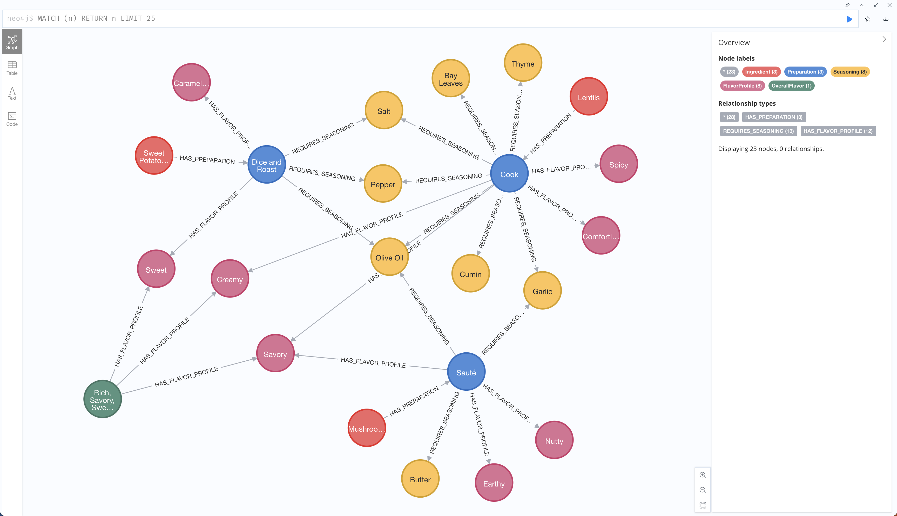

# synthetic-graph-data-generator
synthetic-graph-data-generator는 말 그대로 합성 그래프 데이터를 생성하는 프로그램입니다.
LLM을 이용하여 합성 그래프 데이터를 생성하고, 생성된 데이터를 Neo4j DB에 저장합니다. LLM은 학습 단계에서 수 많은 데이터들을 관측하였고
각 데이터 사이의 관계성을 학습하였기 때문에, 학습된 LLM을 이용하여 합성 그래프 데이터를 생성하면 양질의 합성 그래프 데이터를 얻을 수 있습니다.

<!-- Image -->


## Neo4j 설치
Docker 환경에서 Neo4j 데이터베이스 서버를 활성화 합니다. 
아래 Docker 컨테이너 실행 명령어를 통해 Neo4j를 설치하고 서버를 활성화 합니다. 
```
docker run \
--name neo4j \
-p 7474:7474 -p 7687:7687 \
-d \
-e NEO4J_AUTH=neo4j/pleaseletmein \
-e NEO4J_PLUGINS=\[\"apoc\"\]  \
-e NEO4J_apoc_export_file_enabled=true \
-e NEO4J_apoc_import_file_enabled=true \
-e NEO4J_apoc_import_file_use__neo4j__config=true \
neo4j:latest
```
위 명령어를 실행하면 Neo4j 서버가 실행되고, http://localhost:7474/ 에서 Neo4j Browser를 통해 Neo4j 서버에 접속할 수 있습니다.
참고로 Neo4j Browser의 기본 계정은 neo4j/neo4j 이지만 옵션으로 설정한 NEO4J_AUTH=neo4j/pleaseletmein 을 통해 neo4j/pleaseletmein 계정으로 접속할 수 있습니다.

## Generator
- 자세한 내용은 `generator.ipynb`를 참고바랍니다.